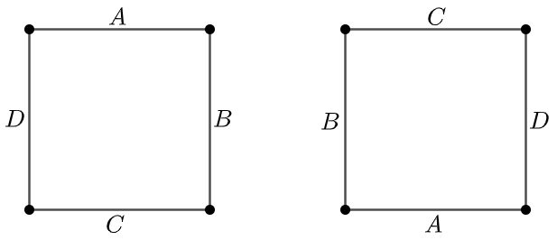

# Can You Escape the Infinite Loop?

**Source:** [https://thefiddler.substack.com/p/can-you-escape-the-infinite-loop](https://thefiddler.substack.com/p/can-you-escape-the-infinite-loop)

**Problem:**
> Suppose I start with a strip of paper that’s 10 inches long and 1 inch wide. I twist it once and attach the two 1-inch edges together, forming a Möbius strip. Finally, I draw a dot somewhere in the center of the strip—that is, the dot is half an inch away from both edges. Naturally, the distance between any two points on my strip is the shortest path between them, as the ant crawls. By that, I mean that such paths can go over an edge to the other “side” of the strip (“side” in quotes because it’s all really the same side, after all), just as an ant would crawl around the edge of the paper. There is a point (or points) on the strip that is the farthest distance from my dot. What is this distance?

**Solution:** $\dfrac{\sqrt{401}}{2}$ inches

**Rationale:** The longest straight line distance on a Möbius strip is equal to the length of the strip. Any path that would continue beyond that length would be closer to the origin from the other direction. Attempting to create a longer path by crossing an edge has a similar effect.

Consider a line segment from edge to edge that is perpendicular to a line drawn down the center of the strip and 10 inches away from the origin (the furthest straight line distance). The endpoints of the segment, which are the points on the edges of the strip, are the further from the intersection, and the two points furthest from the origin. Finding the distance from the origin to these two points can be done using the Pythagorean theorem: $10^2+\frac{1}{2}^2=c^2$.

***

**Problem:**
> Instead of a strip of paper, consider a three-dimensional prism whose bases are regular N-gons. I twist it and stretch it into a loop, before finally connecting the two bases. Suppose that my twist is by a random angle, such that the two bases are aligned when they are connected. I’m interested in how many distinct faces there are in the resulting “Möbius prism.” Among all whole number values of N less than or equal to 1,000, for which value of N will a randomly twisted regular N-gon prism have the most distinct faces, on average?

**Solution:** 840

**Rationale:** In order to explain the algorithm, consider a square prism with the edges of each base labeled A, B, C, and D, with edges with the same letter on the same face.


The first twist would result in the two bases connecting in the following orientation.


Without loss of generality, starting with edge A on the untwisted base, it connects to edge D, which then connects to edge C, which connects to edge B, which connects to edge A. Since this continuation includes each edge, there is only one distinct face.

The next twist would have the bases oriented in the following fashion.



As before, starting with edge A, it connects to edge C, which connects to edge A. This is one distinct face. Starting with the next edge in clockwise order, edge B, it connects to edge D, which connects to edge B. Thus, there are two distinct faces for this twist.

This process can be continued. JavaScript code that completes this task (albeit a bit slowly) can be found below:

```js
let results = new Map();
for (let n = 3; n <= 1000; n++) {
    let initialEdges = Array.from(Array(n).keys());
    let twistedEdges = [...initialEdges];
    let distinctFaces = [];
    for (let t = 1; t <= n; t++) {
        twistedEdges.unshift(...twistedEdges.splice(-1));
        let edgesTraversed = [];
        let startingEdgeIndex = 0;
        let faces = 0;
        do {
            edgesTraversed.push(initialEdges[startingEdgeIndex]);
            let connectedEdge = twistedEdges[startingEdgeIndex];
            while (!edgesTraversed.includes(connectedEdge)) {
                edgesTraversed.push(connectedEdge);
                connectedEdge = twistedEdges[initialEdges.indexOf(connectedEdge)];
            }
            faces++;
            startingEdgeIndex = initialEdges.find(edge => !edgesTraversed.includes(edge));
        } while (startingEdgeIndex > -1);
        distinctFaces.push(faces);
    }
    results.set(n, distinctFaces.reduce((sum, val) => sum + val, 0) / distinctFaces.length);
}
console.log([...results.entries()].reduce((max, curr) => curr[1] > max[1] ? curr : max));
```

It would appear that the average number of distinct faces can be found by finding the [gcd-sum](https://en.m.wikipedia.org/wiki/Pillai%27s_arithmetical_function) for *N* then dividing by *N*. An interesting find by a friend!